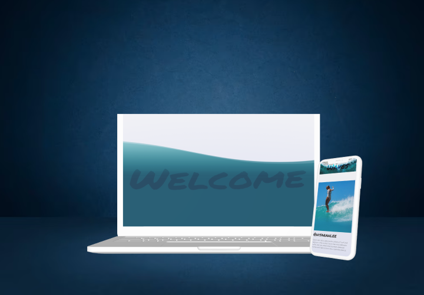

# The wave Project



Welcome to the Surf Photographer Showcase, featuring the top 8 surf photographers. This website combines the power of WebGL, Three.js, shaders, HTML, and CSS to create an different visual experience.

## Dependencies

- [Vite](https://vitejs.dev/): The build tool used for the project.
- [Tailwind CSS](https://tailwindcss.com/): A utility-first CSS framework.
- [Three.js](https://threejs.org/): A 3D library for creating WebGL content.
- [GSAP (GreenSock Animation Platform)](https://greensock.com/gsap/): A powerful animation library for JavaScript.

## How to Run

1.Clone this repository to your local machine:

```
git clone https://github.com/jimjabid/the-wave-project-v1.git
cd the-wave-project-v1
```

### Install dependencies:

```
npm install
```

## Start the development server:

```
npm run dev
```

Open your web browser and navigate to http://localhost:5173 to explore the Surf Photographer Showcase.

## Features

Discover the top 8 surf photographers through stunning visuals powered by Three.js.
Experience smooth animations and transitions using GSAP.
Achieve responsive and efficient styling with Tailwind CSS.
Immerse yourself in captivating shader effects.
Easily customize the codebase to suit your needs.

## Contributions

Contributions are encouraged! Feel free to open issues or submit pull requests with your suggestions and enhancements. Your feedback and ideas are highly valued.

License
This project is licensed under the MIT License.
